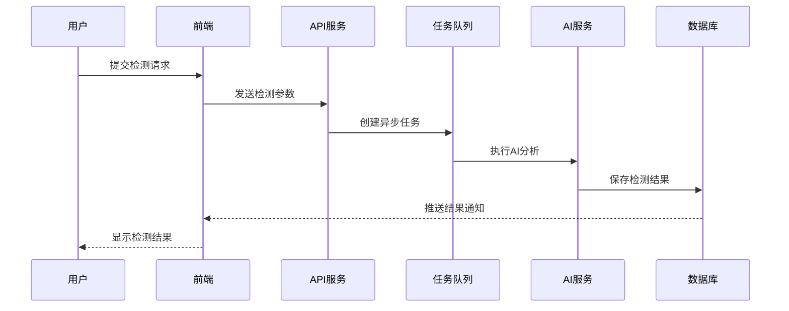

# 🏗️ GEO Insight - 系统架构设计

## 📋 架构概述

GEO Insight 采用现代化的微服务架构，支持高并发、高可用的SaaS服务。系统主要由前端应用、后端API服务、AI处理服务、数据存储和外部集成组成。

---

## 🎯 架构原则

### 核心原则
- **可扩展性**: 支持水平扩展，应对用户增长
- **可维护性**: 模块化设计，便于开发和维护
- **可靠性**: 高可用架构，确保服务稳定
- **安全性**: 多层安全防护，保护用户数据
- **性能**: 优化响应时间，提升用户体验

### 设计模式
- **分层架构**: 表现层、业务层、数据层分离
- **微服务**: 功能模块独立部署和扩展
- **事件驱动**: 异步处理提升系统性能
- **缓存优先**: 多级缓存减少数据库压力

---

## 🏛️ 系统架构图

```
┌─────────────────────────────────────────────────────────────┐
│                        用户界面层                              │
├─────────────────────────────────────────────────────────────┤
│  Web App (Next.js)  │  Mobile App (Future)  │  API Docs     │
└─────────────────────────────────────────────────────────────┘
                                │
                                ▼
┌─────────────────────────────────────────────────────────────┐
│                        API网关层                              │
├─────────────────────────────────────────────────────────────┤
│           Nginx/Cloudflare (负载均衡 + CDN)                   │
└─────────────────────────────────────────────────────────────┘
                                │
                                ▼
┌─────────────────────────────────────────────────────────────┐
│                        应用服务层                              │
├─────────────────────────────────────────────────────────────┤
│  Auth Service  │  Project Service  │  Analysis Service      │
│  (Supabase)    │  (FastAPI)        │  (FastAPI + Celery)    │
└─────────────────────────────────────────────────────────────┘
                                │
                                ▼
┌─────────────────────────────────────────────────────────────┐
│                        数据存储层                              │
├─────────────────────────────────────────────────────────────┤
│  PostgreSQL    │  Redis Cache     │  File Storage           │
│  (Supabase)    │  (缓存+队列)      │  (Supabase Storage)     │
└─────────────────────────────────────────────────────────────┘
                                │
                                ▼
┌─────────────────────────────────────────────────────────────┐
│                        外部集成层                              │
├─────────────────────────────────────────────────────────────┤
│  OpenAI API    │  Perplexity API  │  Web Scraping          │
│  (GPT-4)       │  (AI搜索)         │  (BeautifulSoup)       │
└─────────────────────────────────────────────────────────────┘
```

---

## 🔧 技术栈详解

### 前端技术栈
```yaml
框架: Next.js 14 (App Router)
语言: TypeScript
样式: Tailwind CSS
状态管理: Zustand / React Query
图表: Recharts / Chart.js
部署: Vercel
```

### 后端技术栈
```yaml
框架: FastAPI (Python 3.11+)
认证: Supabase Auth
数据库: PostgreSQL (Supabase)
缓存: Redis
队列: Celery + Redis
部署: Railway / Render
```

### AI & 数据处理
```yaml
LLM: OpenAI GPT-4 API
NLP: spaCy + NLTK
爬虫: BeautifulSoup + Scrapy
异步: asyncio + aiohttp
```

---

## 📦 核心模块设计

### 1. 用户认证模块 (Auth Service)
```python
# 功能职责
- 用户注册/登录
- JWT令牌管理
- 权限控制
- 会话管理

# 技术实现
- Supabase Auth (OAuth + Email)
- JWT + Refresh Token
- Row Level Security (RLS)
```

### 2. 项目管理模块 (Project Service)
```python
# 功能职责
- 项目CRUD操作
- 用户项目关联
- 项目配置管理
- 数据权限控制

# 技术实现
- FastAPI + SQLAlchemy
- PostgreSQL数据存储
- RESTful API设计
```

### 3. AI分析模块 (Analysis Service)
```python
# 功能职责
- AI引用检测
- 内容评分算法
- 优化建议生成
- 异步任务处理

# 技术实现
- Celery异步任务队列
- OpenAI API集成
- 自定义NLP算法
- Redis结果缓存
```

### 4. 数据采集模块 (Scraping Service)
```python
# 功能职责
- 网页内容抓取
- 结构化数据提取
- 反爬虫策略
- 数据清洗处理

# 技术实现
- Scrapy框架
- 代理池管理
- 请求频率控制
- 数据验证机制
```

---

## 🔄 数据流设计

### 1. 用户注册流程


### 2. AI检测流程


---

## 🚀 部署架构

### 开发环境
```yaml
前端: localhost:3000 (Next.js Dev Server)
后端: localhost:8000 (FastAPI + Uvicorn)
数据库: Supabase Cloud (开发项目)
缓存: Redis Cloud (免费层)
```

### 生产环境
```yaml
前端: Vercel (全球CDN)
后端: Railway (容器化部署)
数据库: Supabase (生产级PostgreSQL)
缓存: Redis Cloud (高可用集群)
监控: Sentry + Vercel Analytics
```

### CI/CD流水线
```yaml
代码提交: GitHub
自动测试: GitHub Actions
构建部署: 
  - 前端: Vercel自动部署
  - 后端: Railway自动部署
质量检查: SonarCloud
安全扫描: Snyk
```

---

## 🔒 安全架构

### 认证与授权
- **多因素认证**: 邮箱 + 密码 + 可选2FA
- **JWT令牌**: 短期访问令牌 + 长期刷新令牌
- **权限控制**: 基于角色的访问控制(RBAC)
- **API限流**: 防止恶意请求和DDoS攻击

### 数据安全
- **传输加密**: HTTPS/TLS 1.3
- **存储加密**: 数据库字段级加密
- **敏感信息**: 环境变量管理
- **数据备份**: 自动化备份策略

### 应用安全
- **输入验证**: 严格的参数校验
- **SQL注入防护**: ORM参数化查询
- **XSS防护**: 内容安全策略(CSP)
- **CSRF防护**: 令牌验证机制

---

## 📊 性能优化

### 前端优化
- **代码分割**: 按路由和组件分割
- **图片优化**: Next.js Image组件
- **缓存策略**: 浏览器缓存 + CDN缓存
- **懒加载**: 组件和数据懒加载

### 后端优化
- **数据库优化**: 索引优化 + 查询优化
- **缓存策略**: Redis多级缓存
- **异步处理**: Celery任务队列
- **连接池**: 数据库连接池管理

### 系统监控
- **性能监控**: APM工具集成
- **错误追踪**: Sentry错误收集
- **日志管理**: 结构化日志记录
- **告警机制**: 关键指标监控告警

---

## 🔮 扩展性设计

### 水平扩展
- **无状态设计**: API服务无状态化
- **负载均衡**: 多实例负载分发
- **数据库分片**: 按用户或项目分片
- **缓存集群**: Redis集群模式

### 功能扩展
- **插件架构**: 支持第三方插件
- **API开放**: RESTful API对外开放
- **多租户**: 支持企业级多租户
- **国际化**: 多语言和多地区支持

---

*最后更新: 2024-05-30*
*架构版本: v1.0*
