# 🏗️ GeoLens - 系统架构设计

## 📋 架构概述

GeoLens 是专业的AI引用检测平台，采用后端优先的敏捷架构。系统专注于品牌在生成式AI中的引用检测，提供多模型并行分析、数据持久化和竞品对比功能。当前版本v0.7.0已完成端到端验证，生产就绪。

---

## 🎯 架构原则

### 核心原则
- **可扩展性**: 支持水平扩展，应对用户增长
- **可维护性**: 模块化设计，便于开发和维护
- **可靠性**: 高可用架构，确保服务稳定
- **安全性**: 多层安全防护，保护用户数据
- **性能**: 优化响应时间，提升用户体验

### 设计模式
- **分层架构**: 表现层、业务层、数据层分离
- **微服务**: 功能模块独立部署和扩展
- **事件驱动**: 异步处理提升系统性能
- **缓存优先**: 多级缓存减少数据库压力

---

## 🏛️ 系统架构图

```
┌─────────────────────────────────────────────────────────────┐
│                        用户界面层                              │
├─────────────────────────────────────────────────────────────┤
│  Web App (Next.js)  │  Mobile App (Future)  │  API Docs     │
└─────────────────────────────────────────────────────────────┘
                                │
                                ▼
┌─────────────────────────────────────────────────────────────┐
│                        API网关层                              │
├─────────────────────────────────────────────────────────────┤
│           Nginx/Cloudflare (负载均衡 + CDN)                   │
└─────────────────────────────────────────────────────────────┘
                                │
                                ▼
┌─────────────────────────────────────────────────────────────┐
│                        应用服务层                              │
├─────────────────────────────────────────────────────────────┤
│  Auth Service  │  Project Service  │  Mention Detection     │
│  (Supabase)    │  (FastAPI)        │  Service (FastAPI)     │
└─────────────────────────────────────────────────────────────┘
                                │
                                ▼
┌─────────────────────────────────────────────────────────────┐
│                        数据存储层                              │
├─────────────────────────────────────────────────────────────┤
│  SQLite (Dev)  │  PostgreSQL     │  Redis Cache            │
│  本地数据库     │  (Supabase)     │  (缓存)                 │
└─────────────────────────────────────────────────────────────┘
                                │
                                ▼
┌─────────────────────────────────────────────────────────────┐
│                        外部集成层                              │
├─────────────────────────────────────────────────────────────┤
│  OpenAI API    │  豆包API         │  DeepSeek API           │
│  (GPT-4)       │  (字节跳动)       │  (深度求索)              │
└─────────────────────────────────────────────────────────────┘
```

---

## 🔧 技术栈详解

### 前端技术栈
```yaml
框架: Next.js 14 (App Router)
语言: TypeScript
样式: Tailwind CSS
状态管理: Zustand / React Query
图表: Recharts / Chart.js
部署: Vercel
```

### 后端技术栈 (v0.7.0 已实现)
```yaml
框架: FastAPI (Python 3.11+)
数据库: SQLite + aiosqlite (异步持久化)
ORM: SQLAlchemy + Alembic
架构: 统一服务架构，Repository模式
AI集成: 豆包API + DeepSeek API (真实集成)
测试: 端到端测试 (82.4%通过率)
部署: 本地开发环境，生产就绪
```

### 下一阶段技术栈 (Sprint 6)
```yaml
数据库: PostgreSQL + Supabase (云迁移)
前端: React + TypeScript
认证: Supabase Auth
部署: Vercel + Railway
```

### AI引用检测引擎 (已验证)
```yaml
AI模型: 豆包API + DeepSeek API (真实集成)
检测算法: 统一品牌检测服务 (100%准确率)
并行处理: 多模型同时调用
数据持久化: Repository模式 + SQLite
端到端验证: 82.4%测试通过率
```

---

## 📦 核心模块设计

### 1. 用户认证模块 (Auth Service)
```python
# 功能职责
- 用户注册/登录
- JWT令牌管理
- 权限控制
- 会话管理

# 技术实现
- Supabase Auth (OAuth + Email)
- JWT + Refresh Token
- Row Level Security (RLS)
```

### 2. 项目管理模块 (Project Service)
```python
# 功能职责
- 项目CRUD操作
- 用户项目关联
- 项目配置管理
- 数据权限控制

# 技术实现
- FastAPI + SQLAlchemy
- PostgreSQL数据存储
- RESTful API设计
```

### 3. 引用检测模块 (Mention Detection Service)
```python
# 功能职责
- 多模型并行调用 (豆包、DeepSeek、ChatGPT)
- 智能实体识别和品牌提及检测
- 引用频率统计和分析
- 上下文提取和高亮显示
- 竞品对比分析
- 历史记录管理和Prompt模板库

# 技术实现
- NER + 关键词匹配算法 (准确率100%)
- 多AI服务统一调用层
- Repository模式数据访问层
- SQLite本地持久化存储
- 异步数据库操作和事务管理
- 完整的测试覆盖 (100%数据库测试)
```

### 4. 内容处理模块 (Content Processing Service)
```python
# 功能职责
- 多种内容输入处理
- 内容解析和清洗
- 格式标准化
- 结构化数据提取

# 技术实现
- BeautifulSoup内容解析
- 多格式内容支持
- 智能文本清洗
- 内容质量验证
```

---

## 🔄 数据流设计

### 1. 用户注册流程

```mermaid
sequenceDiagram
    participant U as 用户
    participant F as 前端
    participant A as Auth服务
    participant D as 数据库
    
    U->>F: 提交注册信息
    F->>A: 发送注册请求
    A->>D: 创建用户记录
    D-->>A: 返回用户ID
    A-->>F: 返回JWT令牌
    F-->>U: 注册成功，跳转首页
```


### 2. 引用检测流程

```mermaid
sequenceDiagram
    participant U as 用户
    participant F as 前端
    participant API as API服务
    participant MD as 引用检测引擎
    participant AI as AI模型服务
    participant D as 数据库

    U->>F: 提交引用检测请求
    F->>API: 发送Prompt和品牌列表
    API->>MD: 执行引用检测
    MD->>AI: 并行调用多个AI模型
    AI-->>MD: 返回AI回答
    MD->>MD: 实体识别和引用分析
    MD->>D: 保存检测结果
    D-->>API: 返回检测结果
    API-->>F: 返回引用频率和上下文
    F-->>U: 显示检测结果和可视化
```


---

## 🚀 部署架构

### 开发环境
```yaml
前端: localhost:3000 (Next.js Dev Server)
后端: localhost:8000 (FastAPI + Uvicorn)
数据库: SQLite本地文件 (data/geolens.db)
缓存: Redis Cloud (免费层)
特点: 零配置启动，本地优先开发
```

### 生产环境
```yaml
前端: Vercel (全球CDN)
后端: Railway (容器化部署)
数据库: Supabase (生产级PostgreSQL)
缓存: Redis Cloud (高可用集群)
监控: Sentry + Vercel Analytics
```

### CI/CD流水线
```yaml
代码提交: GitHub
自动测试: GitHub Actions
构建部署: 
  - 前端: Vercel自动部署
  - 后端: Railway自动部署
质量检查: SonarCloud
安全扫描: Snyk
```

---

## 🔒 安全架构

### 认证与授权
- **多因素认证**: 邮箱 + 密码 + 可选2FA
- **JWT令牌**: 短期访问令牌 + 长期刷新令牌
- **权限控制**: 基于角色的访问控制(RBAC)
- **API限流**: 防止恶意请求和DDoS攻击

### 数据安全
- **传输加密**: HTTPS/TLS 1.3
- **存储加密**: 数据库字段级加密
- **敏感信息**: 环境变量管理
- **数据备份**: 自动化备份策略

### 应用安全
- **输入验证**: 严格的参数校验
- **SQL注入防护**: ORM参数化查询
- **XSS防护**: 内容安全策略(CSP)
- **CSRF防护**: 令牌验证机制

---

## 📊 性能优化

### 前端优化
- **代码分割**: 按路由和组件分割
- **图片优化**: Next.js Image组件
- **缓存策略**: 浏览器缓存 + CDN缓存
- **懒加载**: 组件和数据懒加载

### 后端优化
- **数据库优化**: 索引优化 + 查询优化
- **缓存策略**: Redis多级缓存
- **异步处理**: Celery任务队列
- **连接池**: 数据库连接池管理

### 系统监控
- **性能监控**: APM工具集成
- **错误追踪**: Sentry错误收集
- **日志管理**: 结构化日志记录
- **告警机制**: 关键指标监控告警

---

## 🔮 扩展性设计

### 水平扩展
- **无状态设计**: API服务无状态化
- **负载均衡**: 多实例负载分发
- **数据库分片**: 按用户或项目分片
- **缓存集群**: Redis集群模式

### 功能扩展
- **插件架构**: 支持第三方插件
- **API开放**: RESTful API对外开放
- **多租户**: 支持企业级多租户
- **国际化**: 多语言和多地区支持

---

---

## 🗄️ 数据库架构设计

### 渐进式数据库策略
```
Phase 1: 内存存储 ✅ (已完成)
    ↓
Phase 2: SQLite本地存储 ✅ (当前)
    ↓
Phase 3: PostgreSQL云存储 🚀 (计划中)
```

### SQLite数据模型
```sql
-- 引用检测记录表
mention_checks (
    id, project_id, user_id, prompt,
    brands_checked, models_used, status,
    total_mentions, mention_rate, avg_confidence,
    created_at, completed_at, extra_metadata
)

-- 模型检测结果表
mention_results (
    id, check_id, model, response_text,
    processing_time_ms, error_message, created_at
)

-- 品牌提及详情表
brand_mentions (
    id, result_id, brand, mentioned,
    confidence_score, context_snippet, position, created_at
)

-- Prompt模板表
prompt_templates (
    id, user_id, name, category, template,
    variables, description, usage_count, is_public,
    created_at, updated_at
)

-- 统计分析缓存表
analytics_cache (
    id, cache_key, project_id, brand, timeframe,
    data, expires_at, created_at
)
```

### Repository模式架构
```python
# 数据访问层抽象
class MentionRepository:
    - create_check()           # 创建检测记录
    - get_check_by_id()        # 获取检测记录
    - update_check_status()    # 更新检测状态
    - save_result()            # 保存模型结果
    - save_mentions()          # 保存品牌提及
    - get_brand_mention_stats() # 获取统计数据
    - get_brand_comparison_stats() # 获取对比数据
```

---

## 🔗 前后端集成架构

### 集成状态概览
**总体集成完成度**: 85%

| 功能模块 | 前端实现 | 后端API | 集成状态 |
|----------|----------|---------|----------|
| 用户认证 | ✅ 完整 | ✅ 完整 | 🟢 就绪 |
| 项目管理 | ✅ 完整 | ✅ 完整 | 🟢 就绪 |
| 引用检测 | ✅ 完整 | ✅ 完整 | 🟢 就绪 |
| 历史记录 | ✅ 完整 | ✅ 完整 | 🟢 就绪 |
| 模板管理 | ✅ 完整 | ⚠️ 需确认 | 🟡 待验证 |

### API端点映射
```
前端调用 -> 后端端点
"api/check-mention" -> "/api/v1/api/check-mention"
"api/get-history" -> "/api/v1/api/get-history"
"projects" -> "/api/v1/projects"
"auth/login" -> "/api/v1/auth/login"
```

### 双模式架构
- 🎭 **演示模式**: 使用模拟数据，无需后端服务
- 🔗 **真实模式**: 完整的前后端API集成
- 🔄 **无缝切换**: 一键切换运行模式

### 集成测试工具
- 📋 **简单测试**: `python scripts/simple_integration_test.py`
- 🚀 **自动化测试**: `./scripts/start_e2e_test.sh`
- 🔧 **后端测试**: `./scripts/test_backend_only.sh`

---

*最后更新: 2024-12-19*
*架构版本: v2.3 - 前后端集成完成*
