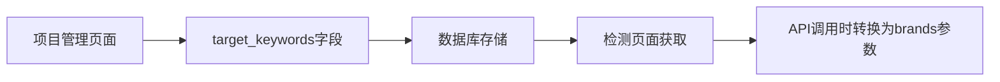

# 🏷️ GeoLens 品牌管理指南

## 📋 概述

GeoLens 的品牌管理功能允许您在项目中维护要监测的品牌和关键词列表。这些品牌将用于AI引用检测，帮助您了解品牌在生成式AI中的提及情况。

---

## 🎯 品牌维护位置

### 主要维护位置：项目管理页面

1. **访问路径**：`http://localhost:8501/Projects`
2. **操作步骤**：
   - 选择或创建一个项目
   - 在项目设置中找到"品牌/关键词管理"部分
   - 添加、编辑或删除品牌

### 使用位置：检测页面

1. **访问路径**：`http://localhost:8501/Detection`
2. **自动获取**：系统会自动从当前项目获取品牌列表
3. **临时选择**：可以在检测时选择要检测的特定品牌

---

## 🛠️ 品牌管理功能

### 1. 预设品牌类别

系统提供了常见的品牌类别，方便快速添加：

- **笔记软件**：Notion, Obsidian, Roam Research, Logseq, Remnote
- **团队协作**：Slack, Teams, Discord, Zoom, Lark
- **设计工具**：Figma, Sketch, Adobe XD, Canva, Framer
- **开发工具**：GitHub, GitLab, VS Code, JetBrains, Sublime
- **项目管理**：Jira, Trello, Asana, Monday, ClickUp

### 2. 手动添加品牌

支持手动输入品牌名称和关键词：

```
Brand A
keyword B
产品名称C
```

**注意事项**：
- 每行一个品牌/关键词
- 支持中英文
- 系统会自动去重
- 建议使用官方品牌名称

### 3. 品牌类型识别

系统会自动识别品牌类型：
- **品牌**：首字母大写的词汇（如：Notion）
- **关键词**：小写或中文词汇（如：笔记软件）

---

## 📊 数据流程

### 1. 数据存储



### 2. 字段映射

| 位置 | 字段名 | 用途 |
|------|--------|------|
| 数据库 | `target_keywords` | 存储品牌列表 |
| 项目管理 | `target_keywords` | 维护品牌 |
| 检测页面 | `target_keywords` → `brands` | 获取并转换 |
| 检测API | `brands` | 执行检测 |

---

## 🎯 最佳实践

### 1. 品牌选择策略

**竞品分析场景**：
```
主品牌：Notion
竞品：Obsidian, Roam Research, Logseq
关键词：笔记软件, 知识管理
```

**行业监测场景**：
```
行业：设计工具
品牌：Figma, Sketch, Adobe XD, Canva
关键词：UI设计, 原型工具
```

### 2. 品牌命名规范

- **使用官方名称**：Notion（不是notion）
- **避免缩写**：Microsoft Teams（不是Teams）
- **包含变体**：GitHub, Github（如果需要）
- **考虑本地化**：微信, WeChat

### 3. 数量建议

- **单次检测**：建议5-10个品牌
- **项目总数**：建议不超过20个品牌
- **性能考虑**：品牌越多，检测时间越长

---

## 🔧 技术实现

### 1. 前端实现

```python
# 获取项目品牌
current_project = get_current_project()
available_brands = current_project.get('target_keywords', [])

# 发送检测请求时的字段映射
detection_params = {
    "brands": selected_brands,  # API期望的字段名
    # ... 其他参数
}
```

### 2. 后端存储

```sql
-- 项目表中的品牌存储
CREATE TABLE projects (
    id UUID PRIMARY KEY,
    target_keywords JSON,  -- 存储品牌数组
    -- ... 其他字段
);
```

### 3. API接口

```http
POST /api/v1/api/check-mention
{
    "brands": ["Notion", "Obsidian"],  -- API使用brands参数
    "prompt": "推荐笔记软件",
    -- ... 其他参数
}
```

---

## 🚀 使用流程

### 完整工作流程

1. **创建项目**
   - 在项目管理页面创建新项目
   - 设置项目基本信息

2. **维护品牌列表**
   - 选择预设类别或手动添加
   - 确保品牌名称准确

3. **执行检测**
   - 进入检测页面
   - 系统自动加载项目品牌
   - 选择要检测的品牌子集

4. **查看结果**
   - 分析品牌提及情况
   - 对比不同品牌表现

### 快速开始示例

```bash
# 1. 创建项目
项目名称：Notion竞品分析
描述：监测Notion在AI推荐中的表现

# 2. 添加品牌
预设类别：笔记软件
选择品牌：Notion, Obsidian, Roam Research

# 3. 执行检测
Prompt：推荐几个好用的笔记管理工具
品牌：选择全部或部分品牌
模型：doubao, deepseek

# 4. 分析结果
查看提及率、置信度、上下文等指标
```

---

## ❓ 常见问题

### Q: 为什么检测页面没有显示我的品牌？
A: 请确保：
1. 已选择正确的项目
2. 项目中已添加品牌
3. 页面已刷新

### Q: 可以在检测时临时添加品牌吗？
A: 目前不支持，请先在项目管理中添加品牌。

### Q: 品牌名称大小写重要吗？
A: 重要。建议使用官方标准名称，如"Notion"而不是"notion"。

### Q: 最多可以添加多少个品牌？
A: 项目中最多20个，单次检测建议不超过10个。

---

## 🔮 未来功能

- **品牌分组管理**：按类别组织品牌
- **品牌别名支持**：支持品牌的多种写法
- **智能品牌推荐**：基于行业推荐相关品牌
- **批量导入导出**：支持CSV格式的品牌列表
- **品牌监测模板**：预设的行业监测模板
